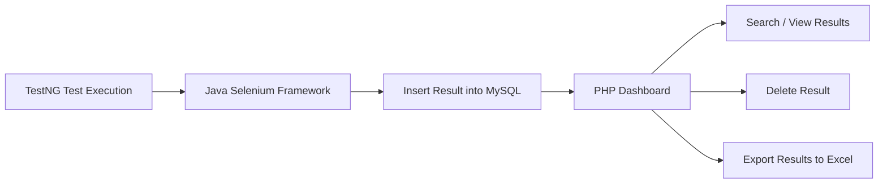

# TestNG Framework in Selenium Project

<p align="center">
  
  
  
  
  
  
</p>

<p align="center">
  A complete automation testing framework built with <b>Java + Selenium + TestNG</b>, integrated with <b>MySQL</b> for test result storage and a <b>PHP dashboard</b> to display, search, manage, and export results to Excel.
</p>

---

## Overview

This project is an end-to-end automation testing solution that combines:

- **Java + Selenium WebDriver** for browser automation
- **TestNG** for test execution and test management
- **MySQL** for storing test results
- **PHP** for building a results dashboard
- **PhpSpreadsheet** for exporting test execution data to Excel

It automates real user scenarios on the demo e-commerce site and stores each test result in a MySQL database, then displays those results in a professional web interface.

---

## Key Features

- Automated UI testing using **Selenium WebDriver**
- Test management with **TestNG**
- Page Object Model style implementation
- Stores **pass/fail** results in **MySQL** automatically after each test
- PHP dashboard to:
  - view test results
  - search test results live
  - delete records
  - export results to **Excel (.xlsx)**
- Admin login flow for controlling dashboard access
- Clean animated UI for login and results pages

---

## Tech Stack

### Automation Layer
- Java
- Selenium WebDriver
- TestNG

### Backend / Reporting Layer
- PHP
- MySQL
- PhpSpreadsheet
- jQuery
- SweetAlert2

---

## Project Workflow



---

## Covered Test Scenarios

This framework includes automated scenarios such as:

- User registration
  - valid registration
  - invalid registration
- User login
  - valid login
  - invalid email
  - invalid password
  - re-login negative case
- Password reset
  - valid email
  - invalid email
- Add-to-cart scenarios for multiple products
- Favorite / wishlist validation
- Product search
- Currency switching
- Random main and sub-category navigation
- Hover interaction on categories
- Navigation across categories with and without subcategories

---

## How Results Are Stored

After each test method runs, the framework captures:

- **Test name**
- **Execution status** (`pass` / `fail`)
- **Created timestamp**

These are inserted into the `results` table in MySQL, making the execution history easy to review from the PHP dashboard.

---

## Database Tables

### `results`
Stores the automation execution results.

| Column | Description |
|---|---|
| `id` | Primary key |
| `test_name` | Test method name |
| `status` | Test status (`pass` / `fail`) |
| `created_at` | Auto-generated timestamp |

### `login`
Stores dashboard login users.

| Column | Description |
|---|---|
| `id` | Primary key |
| `name` | Username |
| `password` | Password |

---

## Project Structure

```bash
testng-framework-in-selenium-project/
│
├── src/test/java/
│   ├── BAGS/
│   │   └── Pages.java
│   └── Test_pages/
│       └── Testpage.java
│
├── php/
│   ├── login.php
│   ├── results.php
│   ├── export.php
│   ├── delete_message.php
│   ├── login.css
│   ├── style.css
│   └── main.js
│
├── database/
│   └── testresults.sql
│
├── pom.xml
├── composer.json
└── README.md
```

> You can rename and reorganize files into this structure in GitHub to make the repository look cleaner and more professional.

---

## Setup Instructions

### 1) Clone the repository

```bash
git clone https://github.com/your-username/testng-framework-in-selenium-project.git
cd testng-framework-in-selenium-project
```

### 2) Configure Java dependencies

Add the required dependencies to `pom.xml`:

- Selenium Java
- TestNG
- MySQL Connector/J

### 3) Import the database

Import the SQL file into MySQL:

```sql
CREATE DATABASE testresults;
```

Then import the included SQL script that creates:

- `results`
- `login`

### 4) Configure PHP dependencies

Install Composer packages:

```bash
composer install
```

### 5) Run local server

Use XAMPP or any PHP local server, then place the PHP files inside your web root.

Example:

```bash
http://localhost/php/results.php
```

### 6) Run the automation tests

Execute your TestNG test suite from your IDE or Maven.

---

## Default Admin Login

```txt
Username: Mostafa
Password: 123
```

or

```txt
Username: M_Sayed
Password: 123
```

> For real projects, credentials should never be hardcoded or stored in plain text.

---

## Screenshots

To make the repository look professional, create an `assets/` folder and add screenshots like these:

```bash
assets/
├── dashboard.png
├── login-page.png
├── excel-export.png
└── test-execution.png
```

## Recommended Images to Add

For a strong GitHub repository presentation, take screenshots of:

1. **Results dashboard page**
2. **Login page**
3. **Exported Excel file**
4. **Database table in phpMyAdmin**
5. **TestNG execution output**
6. **Project folder structure inside IDE**

---

## Why This Project Stands Out

This project is more than just an automation framework.
It demonstrates how automated test execution can be connected to a full reporting pipeline:

- Execute tests with Selenium + TestNG
- Store execution data in MySQL
- Visualize results with PHP
- Export reports to Excel

This shows practical skills in:

- Test automation
- Java development
- Database integration
- Backend reporting systems
- Full project integration

---

## Future Enhancements

- Add screenshots automatically on test failure
- Generate HTML reports using Extent Reports or Allure
- Add CI/CD using GitHub Actions
- Add cross-browser execution
- Secure login with hashed passwords
- Add filtering by date and status
- Add charts for pass/fail analytics

---

## Author

**Mohamed Elsayed**

- QA Automation Engineer
- Java Selenium Tester
- Interested in building smart testing and reporting systems

---

## Support

If you like this project, give it a **star** on GitHub.

---

## License

This project is for learning, practice, and portfolio demonstration.
